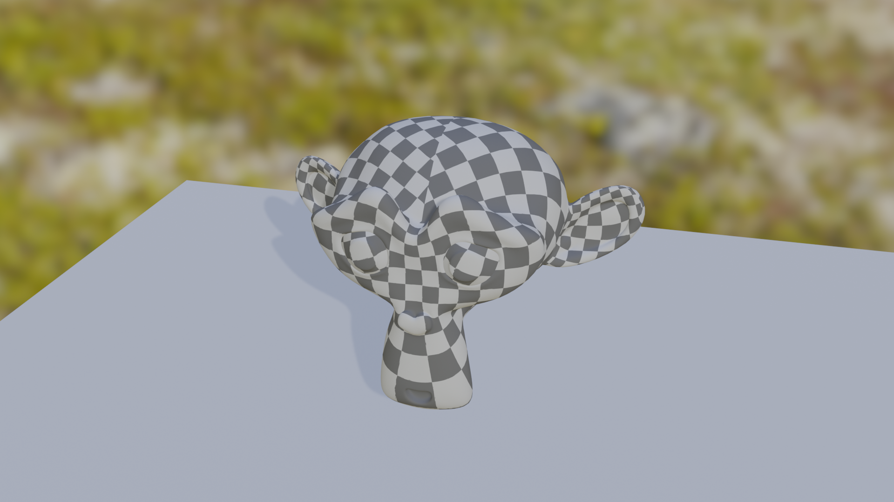

# What is Tight Model Format
The main goal of the tmf project is to provide a way to save 3D game assets compressed in such a way, that there are no noticeable changes to the quality of the model when it is used in a game. This is achieved without sacrificing model read speeds, at the cost of increased model write speed, although in many cases model write speed is still on par or below other formats due to decreased IO usage. 
Currently, TMF provides data compression ratio failing roughly between 4.2 and 1.95, depending on the model.
## How are high compression speeds achived?
Currently on default settings TMF uses bitvise operations(bitshift and or) to read data, which makes it able to read data at speed reaching 40 mln vertices / s. Additionaly TMF is thread safe, allowing for decoding of many models at the same time by many cores, increasing speed even further.
## How does it work?
While I mark tmf as a "lossy compression format" in a classical meaning of this word, it really does not *compress* anything (at least for now). The bulk of the space savings come from storing the model data in different data structures that better reflect the data they store, and removing some data *precision* from the model in such a way, that it's **topology does not change** and the difference between more precise original data and less precise saved data is not noticeable by any human, even on close inspection. This is achieved by using some properties of the data itself (Surface vector being always normalized) or the model (usually constant level of detail across the whole model).
# Comparisions
The model used in test is the blender monkey(Suzzane). TMF files were saved with default settings(`TMFPrecisionInfo::default()`).
## File size comparison
| Format | Size |
|--------|------|
| .obj   | 1.3 MB |
| zip(deflate) compressed .obj | 367.7 kB |
| .fbx | 651.0 kB |
| zip(deflate) compressed .fbx | 600.6 kB |
| .gltf | 476.5 kB |
| zip(deflate) compressed .gltf | 302.1 kB |
| .glb |  356.6 kB|
| zip(deflate) compressed .glb| 267.5 kB |
| .tmf |  308.3 kB |
| zip(deflate) compressed .tmf | 307.9 kB |
## Model render comparison
| Uncompressed .obj | Compressed .tmf file(default settings) |
| ------------------ | ---------------------------------------|
|  |  |
## TMF vs. Draco.
Draco is noticably better at compression than TMF. If all you are looking for is reduced file size, then just use Draco. As a single deveolper there is no way I can manage to create something that even rivals it. **But** if what you are looking for is not only model compression ratio, then TMF still has a lot to offer. 
### A comparison of some pros and cons
| Category | Draco | TMF | 
|----------|-------|-----|
| Compression Ratio | Draco wipes the floor with TMF in terms of compression ratio reducing the size by over 98% | TMF can compress your file by up to 70% 
| 3D model(Suzanne) read time | 7-10 ms | ~1ms |
| Impact of compression on read time | Read time increases with compression level | For most settings read time **decreases** with compression level |
| 3D model(Suzanne) write time | 10-18 ms | 1-2 ms |
| Final binary size of the lib | 4 MB | 204.4 kB |
| Codebase size in lines | 74513 | 3191 |
| Dependenices | Eigen, tinygltf | Only rust stdlib and `small_vec`|
| Language | C++ | Rust |
| Official Rust support | None | Native |
| Build Dependencies | C++ compiler, cmake, make | only standard rust tollchain |
| Using in rust porject | Requires manual linking | installs and links automaticaly using cargo |
### TLDR
tmf aims to be decnet at its job, lightweight and easy to use with Rust. Draco aims to be best at its job, but is bulkier and has no Rust support.
## What can lead to compression of a particular being less efficient?
Greatly varying LOD: The save system dynamically adjusts to the LOD of the mesh. For example, a low-poly castle mesh may be saved with precision of 10 cm and a strawberry model may be saved with 1 mm precision. Saving those two object in one *mesh*(not file!) will force the castle mesh to be saved with higher precision, wasting space. Because most meshes will naturally have a consistent LOD, and meshes that don't would almost always lead to issues elsewhere, this problem is rarely encountered.
# Examples
## Mesh loading
Loading one mesh
```rust
use tmf::TMFMesh;
use std::fs::File;
let input = File::open("suzanne.tmf").expect("Could not open .tmf file!");
let (mesh,name) = TMFMesh::read_tmf_one(&mut input).expect("Could not read TMF file!");
// Geting mesh data
let vertices = mesh.get_vertices().expect("No vertices!");
let vertex_triangles = mesh.get_vertex_triangles().expect("No vertiex triangle array!");
let normals = mesh.get_normals().expect("No normals!");
let normal_triangles = mesh.get_normal_triangles().expect("No normal triangle array!");
let uvs = mesh.get_uvs().expect("No uvs!");
let uv_triangles = mesh.get_uv_triangles().expect("No uv triangle array!");
// Can provide arrays laid out like OpenGL buffers for ease of use when developing games!
let buff_vert_array = mesh.get_vertex_buffer();
let buff_norm_array = mesh.get_normal_buffer();
let buff_uv_array = mesh.get_uv_buffer();
```
Loading multiple meshes
```rust
use tmf::TMFMesh;
use std::fs::File;
let input = File::open("suzanne.tmf").expect("Could not open .tmf file!");
let meshes = TMFMesh::read_tmf_one(&mut input).expect("Could not open TMF file!");
for (mesh,name) in meshes{
    do_something(mesh,name);
}
```
## Mesh Saving
Saving one mesh
```rust
use tmf::TMFMesh;
use std::fs::File;
let output = File::create("suzanne.tmf").expect("Could not create output file!");
let settings = TMFPrecisionInfo::default();
mesh.write_tmf_one(&mut output,&settings,name).expect("Could not save TMF mesh!");
```
Saving multiple meshes
```rust
use tmf::TMFMesh;
use std::fs::File;
let output = File::open("suzanne.tmf").expect("Could not create .tmf file!");
TMFMesh::write_tmf(meshes,&mut input,&settings).expect("Could not write TMF mesh!");
```
# Features
# 0.1 (Current version)
- [X] Exporting .obj
- [X] Importing .obj
- [X] Importing not-triangulated .obj models - **experimental**, supports only convex polygons
- [X] Writing/Reading .tmf files
- [X] Point Positions
- [X] Point Normals
- [X] Point Uv coordinates
- [X] Mesh triangles
- [X] Point clouds
- [X] Multiple meshes in one file
- [X] Fully customizable save precision settings
- [X] Support Different compression types for each UBA *currently only used for normal triangles, but implementation future-proof*
- [X] Full documentation
- [X] Examples for each function in the crate
# Planed Features
- [ ] Vertex groups 
- [ ] Materials *some initial work already done*
- [ ] LZZ compression for UBA
# More in-depth explanation of compression
## Math-based savings
Many formats used for saving of 3D models are shockingly wasteful. There are *a lot* of opportunities to reduce file size, even when using lossless compression. For example, many model formats treat surface normal vectors like any other vectors. But they *aren't* like other vectors! They have some special properties, which can be exploited to save them more efficiently. Namely:
1. All components in a normal vector fall into range <-1,1>. This means that values such as 1.3, 123.0, 69.323, or even 6.50e+12 can **never** occur in a normal vector, so saving them using a format which supports those values is wasteful.
2. All normal vectors fulfil conditions x^2 + y^2 + z^2 = 1. This means, that there are a *lot* of vectors that have all their components in range <-1,1> but aren't valid surface normals. If saving those invalid values is supported, this means that there is wasted space. 
So, by taking into consideration those properties of normals, they can be saved in such a way that each combination of saved bits correspond to a different normal, wasting no space! 

An analogical approach is taken for each and every element of model data, reducing the size even further.
## Bits vs Bytes based savings.
A disadvantage of using byte-aligned data types is lack of granularity of precision when saving data. A good example of this may be a UV coordinate that should represent a point on a 1024 pixel texture, with precision of .25 pixels. Doing some quick back of the napkin maths, it can be determined that a precision of log2(1024/.25) = log2(4096) = 12 bits is required. But only available data types are either too small (u8) or way too big(u16, 25% of disk space would go to waste!). The solution is forgoing byte alignment. It comes with a slight performance penalty of having to do bit shifts, and inability to use pre-built compression algorithms (they assume byte-alignment), but come with huge advantage of using data types just wide enough to save what is needed and not any wider. 
Data is laid out like that in what I call an UBA (Unaligned Binary Array). Data in an UBA consists of a series of data with any binary size, where consecutive data may cross byte boundaries, start or end at any point in a byte, and there is no padding. The size of elements is usually specified before the UBA itself. For some widths, like 9 bits, savings coming from musing UBA's can reach as much as 44%!
# Specification
Along with this project comes a slightly more in-depth technical specification
in `TMF_SPEC.md`. While not fully finished, it can still prove to useful for anyone who is interested in understanding the project better(If you have any questions feel free to ask me). 
